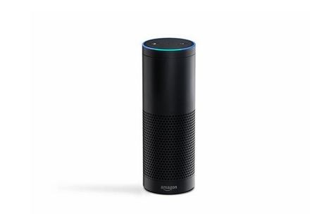
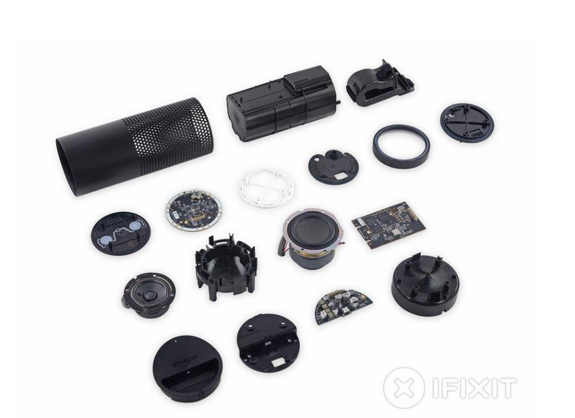

## 1 DESCRIÇÃO DO PRODUTO REFERÊNCIA

Como referência para esse projeto, temos um produto bem maduro no
mercado, a Alexa, da Amazon, foi lançado em 2014 junto à linha de dispositivos
Echo, se tornou a principal referência de mercado no segmento de assistentes
virtuais inteligentes baseados em voz. Operando primariamente através de uma
arquitetura em nuvem, o sistema processa comandos de áudio em tempo real para
executar tarefas que vão desde a reprodução de mídias até o gerenciamento
complexo de ecossistemas de automação residencial ( _smart home_ ). No escopo
deste trabalho teórico-exploratório, a Alexa é adotada como o _benchmark_ funcional e
de usabilidade, servindo de modelo estrutural para a concepção do ecossistema
customizado baseado em ESP

### 1.1 Descrição do produto, Contexto e Mercado

O produto é um assistente de voz baseado em IA com o conceito JARVIS,
que toma como base os assistentes residenciais modernos como a linha Amazon
Echo/Alexa, fundindo suas capacidades funcionais com o conceito de inteligência
computacional pervasiva do projeto ficcional JARVIS (Just A Rather Very Intelligent
System), que será implementado como nossa solução customizada em uma
plataforma ESP32. Trata-se de um sistema embarcado cyber físico centralizado,
focado no processamento de linguagem natural (PLN), automação residencial
adaptativa e interação humano-computador por voz de baixa latência.
O mercado de assistentes de voz comerciais consolidou-se a partir de 2014
com o lançamento do Amazon Echo original, evoluindo de simples caixas de som
controladas por comandos rígidos para hubs de automação residencial que integram
LLMs (Large Language Models) locais ou em nuvem, permitindo inferências
complexas. O conceito JARVIS expande essa evolução adicionando uma identidade
mais proativa e integrada ao ambiente do usuário, agora viabilizada em hardware
acessível como o ESP32.
As funções principais do sistema incluem reconhecimento de palavra de
ativação (JARVIS), síntese de voz em tempo real (TTS - Text-to-Speech), controle de
atuadores residenciais como iluminação e relés, e monitoramento ambiental
preventivo com feedback sonoro e visual personalizado.
O público-alvo compreende entusiastas de automação residencial (smart
home), desenvolvedores e o setor de acessibilidade. O dispositivo atua em
ambientes residenciais e de escritório, permitindo que pessoas com limitações
motoras ou visuais controlem seu ambiente físico exclusivamente por comandos de
voz, assim como os dispositivos Echo já proporcionam, mas com a flexibilidade e
customização que nossa implementação JARVIS na ESP32 pode oferecer.

<figure>
    
    <figcaption>Fonte: iFixit (2014).</figcaption>
</figure>

### 1.2 Descrição do Hardware

A iFixit, maior comunidade global de reparos, desmontou completamente o
Amazon Echo original para revelar seus componentes internos. O processo gerou
uma documentação fotográfica detalhada e atribuiu uma nota de reparabilidade ao
dispositivo. Ao democratizar essas informações, a plataforma capacita os usuários a
consertarem seus próprios aparelhos com segurança. Isso prolonga a vida útil dos
produtos, combate o lixo eletrônico e reforça a missão da iFixit de promover a
independência do consumidor.

Na base do dispositivo fica a placa de alimentação e áudio, gerenciando a
energia e o som com componentes da Texas Instruments. O regulador TPS
estabiliza a tensão, enquanto o codec TLV320DAC3203 converte o áudio digital em
analógico de forma eficiente. O amplificador TPA3110D2 impulsiona o alto-falante
com até 15W e baixa distorção. Mapear a função de cada um desses chips é
essencial para facilitar o diagnóstico de falhas e a substituição precisa de peças.

A placa-mãe atua como o cérebro do Echo, comandada pelo processador
DM3725CUS100, que gerencia a inteligência do sistema. A estrutura conta com 256
MB de RAM da Samsung, 4 GB de armazenamento flash da SanDisk e um módulo
Wi-Fi/Bluetooth da Qualcomm para conectividade. Tudo é orquestrado por um
gerenciador de energia integrado. Compreender essa arquitetura complexa e como
as placas interagem entre si é o que permite reparos eficientes.

<figure>
    
    <figcaption>Fonte: iFixit (2014).</figcaption>
</figure>

No topo do Echo encontra-se a placa de microfones e LEDs, responsável pela
interface de interação. Ela dispõe de sete microfones em círculo, apoiados por
conversores analógico-digitais que garantem a clareza dos comandos de voz em
360 graus. Drivers programáveis controlam o anel luminoso, enquanto componentes
mantêm os sinais sincronizados. Toda essa estrutura é isolada por espuma acústica,
evidenciando uma engenharia meticulosa que ainda permite reparos pontuais.

### 1.3 Descrição de software

##### 1.3.1 Restrições de Hardware e a Arquitetura de Escuta Local

A compreensão das exigências de software e rede que regem um
ecossistema de _smart speakers_ exige uma análise aprofundada da arquitetura de
processamento dos dispositivos de referência de mercado, com especial destaque
para a linha Amazon Echo. Conforme revelado por estudos de engenharia reversa, a
operação local do dispositivo é severamente limitada por restrições de hardware e
consumo energético. O software do alto-falante de referência executa suas funções
sobre um processador ARM Cortex-A8 de 1GHz, dedicando continuamente cerca de
50% de todo o seu tempo de CPU para o processo de reconhecimento da palavra de
ativação. Essa tarefa de escuta passiva permanente é gerenciada pelo daemon local
denominado ASRD ( _Automatic Speech Recognition Daemon_ ), que utiliza o motor

_Pryon_ , desenvolvido a partir do kit de ferramentas de código aberto _Kaldi_. O modelo
acústico executado localmente é baseado em Redes Neurais Profundas (DNN) e
possui um tamanho inferior a 2 MB. Devido a essa compactação extrema, o
hardware isolado é capaz apenas de realizar a detecção primária de palavras-chave,
tornando a conectividade externa o canal indispensável para transferir o fluxo de
áudio para uma infraestrutura em nuvem capaz de executar tarefas complexas de
processamento de linguagem natural.

##### 1.3.2 Otimização da Camada de Transporte via Wi-Fi e Protocolo SPDY

Para mediar o fluxo de dados distribuído entre o cliente em nível embarcado e
os servidores remotos, o ecossistema utiliza uma interface nativa de rede Wi-Fi de
dupla banda, operando de maneira estratégica nas frequências de 2.4 GHz e 5 GHz.
A faixa de 2.4 GHz é explorada pelo software para transpor barreiras físicas
estruturais e estender o alcance do sinal na residência, enquanto a faixa de 5 GHz
provê maior largura de banda e imunidade contra o congestionamento do espectro.
O gerenciamento lógico e a comunicação direta com a nuvem são centralizados pelo

daemon AlexaDaemon. O grande diferencial dessa camada de software consiste no
emprego do protocolo **SPDY** para gerenciar o canal de transporte sem fio. Ao
implementar a multiplexação de múltiplos fluxos bidirecionais simultâneos sobre uma
única conexão TCP estável, o SPDY elimina o _overhead_ de abertura de conexões
repetidas. Essa escolha arquitetural de software garante que logs de telemetria,
comandos de controle de estado e pacotes de sincronização trafeguem de forma
síncrona e paralela ao streaming de áudio bruto, mitigando atrasos na comunicação
e otimizando de forma crítica a latência global do sistema.

# 1.3.3 Mecanismo Reativo de Verificação em Dois Estágios

O acionamento da infraestrutura de rede ocorre de maneira reativa por meio
de uma arquitetura de verificação em dois estágios, projetada pelo software para
balancear a usabilidade com a privacidade e o consumo de banda. No primeiro
estágio, o classificador do daemon local ASRD analisa as janelas de áudio
capturadas e emite um score de certeza entre 0.0 e 1.0. Sob condições normais, um
valor igual ou superior ao limiar de 0.57 classifica o evento como uma aceitação
legítima, alterando o estado do dispositivo para o modo de envio de dados
(SendingDataToAlexa). O sistema inicializa o AudioEncoderDaemon para codificar o áudio em
tempo real e transmitir o fluxo para o _Alexa Voice Service_ na nuvem, incluindo uma
janela preventiva de aproximadamente 0.5 segundos de gravação anterior ao
gatilho. Caso o som ambiente fique abaixo de 0.57, o software categoriza o evento
como um quase acerto ( _NearMiss_ ), bloqueando preventivamente qualquer upload de
dados. No segundo estágio, a nuvem realiza uma auditoria rigorosa do sinal. Se os
algoritmos remotos confirmarem a ativação, o dispositivo entra no modo de
processamento e posterior síntese de voz. Se a nuvem detectar um gatilho acidental, 
um comando de rede ordena a interrupção imediata do fluxo, finalizando o
processo de descarte em apenas 1 ou 2 segundos.

##### 1.3.4 Gerenciamento de Protocolos Periféricos e Automação Local

Além do canal direto com a nuvem, o software gerencia ecossistemas de
comunicação local de curto alcance voltados para a experiência do usuário e a
domótica residenciais. Durante o ciclo inicial de configuração, o protocolo Bluetooth
Low Energy (BLE) é empregado para estabelecer uma camada de pareamento
seguro com o aplicativo móvel, permitindo a injeção direta das credenciais Wi-Fi sem
expor redes temporárias vulneráveis. Para o controle de casa inteligente, o software
de modelos avançados interage com coprocessadores de rádio baseados na norma
IEEE 802.15.4 para coordenar redes locais via protocolo Zigbee em topologia mesh,
eliminando a dependência de hubs proprietários externos.
Essa camada evoluiu para incorporar os padrões industriais Matter e Thread,
consolidando o assistente como um controlador universal baseado em IP capaz de
rotear comandos de automação localmente. Por fim, a eficiência operacional da rede

é mantida em background pelo processo metricsCollector, que realiza
sincronizações periódicas via Wi-Fi para baixar pacotes de hashes de assinaturas
acústicas de comerciais de televisão e mídias de massa. Quando o sinal capturado
coincide localmente com uma dessas impressões digitais, o software aborta
preventivamente a inicialização dos daemons de streaming, impedindo que
ativações em massa geradas por transmissões ao vivo sobrecarreguem a banda de
rede residencial.

### 1.4 Referências de Fábrica

**Alexa Voice Service (AVS) e Alexa Skills Kit (ASK):** Documentação oficial
da Amazon detalhando a arquitetura de integração entre hardware de terceiros e a
nuvem da Alexa para processamento de intenções e síntese de voz.

```
Fonte:
https://developer.amazon.com/pt-BR/alexa/alexa-skills-kit
```
**Engenharia Reversa e Arquitetura de Hardware:** Documentação técnica
baseada em desmontagem (teardown) do Amazon Echo original, evidenciando a
disposição da matriz de microfones e processadores.

```
Fonte:
https://pt.ifixit.com/Teardown/Amazon+Echo+Teardown/33953?lang=en
```
