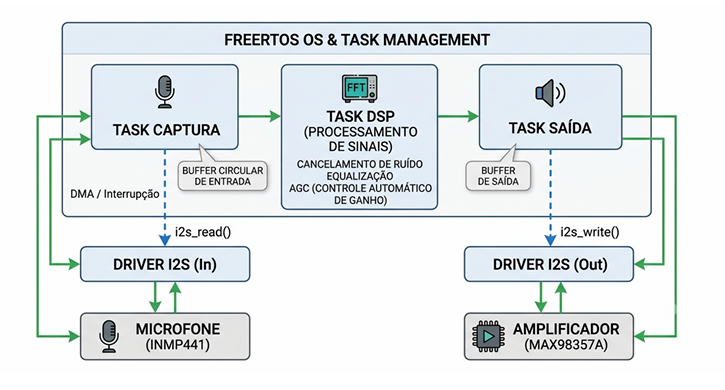
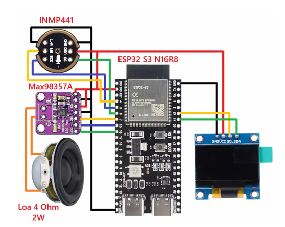

## 3 PROPOSTA DE IMPLEMENTAÇÃO

Esta seção apresenta o modelo conceitual e a arquitetura técnica propostos
para reproduzir as funcionalidades do assistente de voz utilizando o
microcontrolador ESP32. A seguir, são detalhados a especificação dos componentes
equivalentes compatíveis com o ecossistema ESP-IDF, a lógica de gerenciamento
do firmware e o diagrama em blocos do sistema.

### 3.1 Firmware e Componentes de Áudio

Para recriar as capacidades de áudio com a ESP32 sob o ecossistema
ESP-IDF, propõe-se uma arquitetura baseada no protocolo digital I2S (Inter-IC
Sound), eliminando ruídos gerados por DACs/ADCs analógicos simples. Na captura
de áudio, utiliza-se o microfone I2S INMP441, um microfone digital MEMS de alta
performance e omnidirecional que entrega o sinal diretamente quantizado em PCM
de 24 bits para o barramento I2S da ESP32, enquanto na reprodução de áudio
emprega-se o amplificador I2S MAX98357A, um amplificador de classe D que
recebe o stream digital I2S direto da ESP32 e faz a conversão e amplificação direta
para um alto-falante de até 3.2W.

Como interface física "estilo JARVIS", o sistema conta ainda com uma tela
OLED 0.98" (I2C) para renderizar a interface de ondas e animações características
do assistente, completando o conjunto de sensores e atuadores que dão vida à
experiência interativa do projeto.

#### 3.1.1 Gerenciamento do Fluxo de Áudio no Firmware (ESP-IDF)

O firmware será estruturado usando o framework **ESP-ADF** ( _ESP Audio
Development Framework_ ), que roda sobre o FreeRTOS nativo do ESP-IDF.

<figure>
      <figcaption style="text-align: center;">Diagrama do fluxo de processamento do áudio embarcado</figcaption>
    
    <figcaption></figcaption>
</figure>

O processo se inicia com uma tarefa prioritária do FreeRTOS, que lê
continuamente os buffers DMA (Direct Memory Access) do driver I2S acoplado ao
microfone INMP441. Em seguida, esses dados de áudio em tempo real passam pelo
algoritmo de detecção de atividade de voz (VAD) e pelo modelo local leve da
Espressif (WakeNet), especialmente treinado para reconhecer o termo de ativação
“JARVIS”.

Uma vez que o sistema é ativado por esse comando, o áudio captado é
imediatamente encapsulado em pacotes TCP/UDP e enviado via Wi-Fi para um
backend de processamento de linguagem natural, podendo também ser tratado de
forma local caso se trate de uma automação simples.

Por fim, ao receber a resposta de áudio sintetizada (como áudio PCM ou MP
bruto), a tarefa de saída entra em ação: uma fila gerencia a decodificação do stream
e injeta os dados de volta nos buffers DMA do canal I2S de saída, reproduzindo a
resposta sonora no amplificador MAX98357A.

<figure>
      <figcaption style="text-align: center;">Esquemático dos componentes do sistema com Esp32</figcaption>
    
    <figcaption>Fonte: DIY Pocket Size ESP32 AI Voice Assistant With Xiao (Instructables, 2026).</figcaption>
</figure>

### 3.4 Desafios de Software e Integração

**Sobrecarga de Rede e Latência Wi-Fi:** O Echo original utiliza o protocolo
otimizado SPDY e frequências de 5 GHz para garantir baixa latência. O ESP32,
operando restrito a redes Wi-Fi 4 (2.4 GHz), está mais suscetível a
congestionamentos espectrais , o que não apenas atrasa o encapsulamento e envio
dos pacotes TCP/UDP para as APIs em nuvem , mas também compromete
severamente o fluxo de retorno. A instabilidade e a latência na rede impactam
criticamente o _buffering_ de chegada do áudio sintetizado (TTS) recebido do servidor.
Como o ESP32 precisa manter a fila do decodificador abastecida para alimentar os
_buffers_ DMA do canal I2S de saída de forma contínua , qualquer flutuação ou atraso
na recepção dos pacotes de rede resulta em cortes, interrupções ou "engasgos"
perceptíveis durante a reprodução da resposta no alto-falante.

**Restrição de Memória RAM para** **_Buffers_** **:** A implementação exige a
manutenção de um _buffer_ de áudio circular contínuo usando DMA (Direct Memory
Access) para capturar a janela de áudio anterior à palavra de ativação. O
gerenciamento dessa memória na SRAM estritamente limitada do ESP32-WR ,
concorrendo de forma simultânea com as alocações dinâmicas das tarefas do
FreeRTOS e com o peso da pilha da rede Wi-Fi, representa um gargalo crítico. Essa
concorrência torna-se ainda mais severa ao processar o algoritmo local de _WakeNet_
em paralelo com o _buffer_ de recepção da _Task_ de Saída, visto que ambos exigem
blocos significativos de memória contígua. A falta de otimização rigorosa nesse
cenário pode gerar alta fragmentação do _heap_ , resultando em _overflows_ de _buffer_ ,
descarte abrupto de pacotes e travamento generalizado do _firmware_ pelo _Task
Watchdog Timer_ do ESP-IDF.